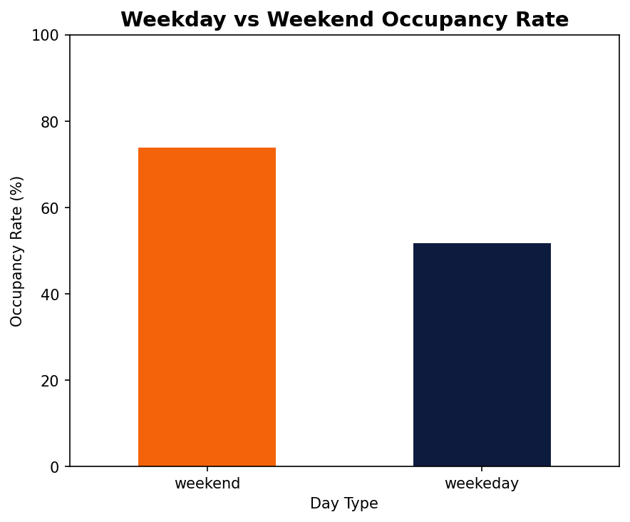
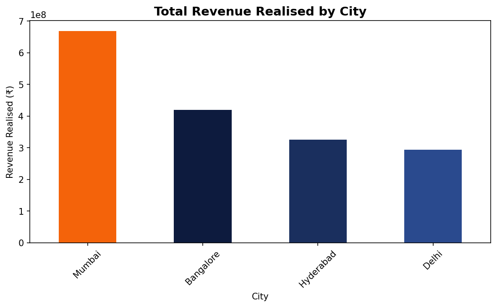
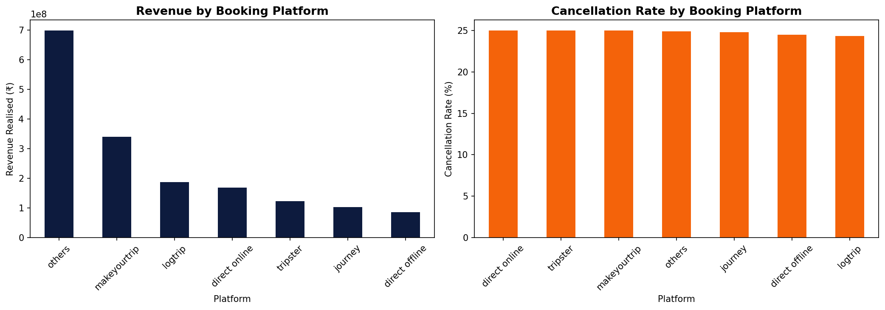
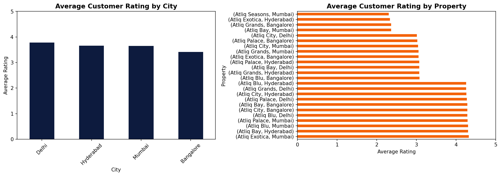

# 🏨 Hospitality Performance Analytics — Python EDA

> **Can data reveal why a 20-year hotel group is losing 
> market share to competitors?**
>
> Exploratory Data Analysis on hotel booking data using Python — occupancy, revenue, cancellation and ratings insights.
> 
> This project analyses 134,590 hotel bookings across 
> 4 cities and 25 properties to find out exactly where, 
> when and why performance is declining — and what 
> management should do about it.

---

## 💡 Business Impact

| Finding | Potential Impact |
|---|---|
| Weekday occupancy at 51.81% — 18 points below benchmark | ₹150–200M revenue uplift opportunity |
| Delhi highest occupancy but lowest revenue | 15–20% room rate increase justified |
| 25% cancellation rate across all properties | Systemic policy change required |
| Bangalore last in occupancy, revenue AND ratings | Urgent operational review needed |

---

## 🎯 Business Problem

A hotel group with **20+ years of market presence** is 
losing revenue and market share to competitors across 
Delhi, Mumbai, Bangalore and Hyderabad.

Senior management commissioned a **data-driven operational 
audit** to answer three questions:

- 🔴 **Where** is the business underperforming?
- 🟡 **When** does performance drop?
- 🟢 **Why** — occupancy, pricing, channels or ratings?

---

## 📊 Key Insights at a Glance

### Weekday vs Weekend Occupancy Gap


### Revenue by City


### Booking Platform Performance


### Customer Ratings by Property


---

## 🛠️ Skills Demonstrated


| Skill | What was applied |
|---|---|
| **Exploratory Data Analysis** | 8 structured business insights |
| **Statistical Outlier Removal** | Mean ± 3×Std method on revenue data |
| **Feature Engineering** | Occupancy %, RevPAR, Cancellation Rate |
| **Data Cleaning** | Null handling, invalid records, date conversion |
| **Data Visualisation** | Bar, line, horizontal bar, side by side charts |
| **Business Intelligence** | KPI design, root cause analysis, recommendations |

---

## 📂 Dataset Overview

| File | Rows | Description |
|---|---|---|
| `fact_bookings.csv` | 134,590 | Individual booking records |
| `fact_aggregated_bookings.csv` | 9,200 | Daily room bookings vs capacity |
| `dim_hotels.csv` | 25 | Property details — name, category, city |
| `dim_rooms.csv` | 4 | Room type mapping RT1–RT4 |
| `dim_date.csv` | 92 | Calendar — week number, day type |

---

## 🔍 Analytical Workflow
```
Raw Data → Validation → Cleaning → Transformation → Insights → Recommendations
```

| Phase | Key Actions |
|---|---|
| **Validation** | Shape, dtypes, null checks across all 5 datasets |
| **Cleaning** | Removed invalid guests, revenue outliers via Mean±3Std, converted dates |
| **Transformation** | Engineered Occupancy %, RevPAR, Cancellation Rate, Length of Stay |
| **Insights** | 8 insights across occupancy, revenue, platforms and ratings |
| **Recommendations** | 6 prioritised actions with estimated business impact |

---

## 🎯 Recommendations

| Priority | Recommendation | Expected Impact |
|---|---|---|
| 🔴 Urgent | Weekday corporate packages — Delhi, Mumbai, Hyderabad | ₹150–200M revenue uplift |
| 🔴 Urgent | Room rate review in Delhi — occupancy supports 15–20% increase | Direct revenue gain |
| 🔴 Urgent | Full operational audit of Bangalore properties | Arrest revenue decline |
| 🟡 Medium | Direct booking loyalty programme | Reduce commission costs |
| 🟡 Medium | Classify and audit "Others" booking category | Improve channel visibility |
| 🟡 Medium | Minimum 3.5 rating standard across all properties | Protect booking conversion |

---

## 📁 Repository Structure
```
Hospitality-EDA-Python/
│
├── hospitality_eda.ipynb    ← Full analysis notebook
├── requirements.txt         ← Python dependencies
├── README.md
└── visuals/
    ├── occupancy_by_city.png
    ├── weekday_vs_weekend.png
    ├── revenue_by_city.png
    ├── monthly_revenue_trend.png
    ├── platform_performance.png
    └── customer_ratings.png
```

---

## 🚀 Run This Project
```bash
git clone https://github.com/HP85-NL/Hospitality-EDA-Python.git
cd Hospitality-EDA-Python
pip install -r requirements.txt
jupyter notebook hospitality_eda.ipynb
```

---

## 👤 Author

**Harshil Patel**  
MBA — Data Analytics Specialisation  
Netherlands

[](https://linkedin.com/in/harshil-patel-188b2274/)
[](https://github.com/HP85-NL)
